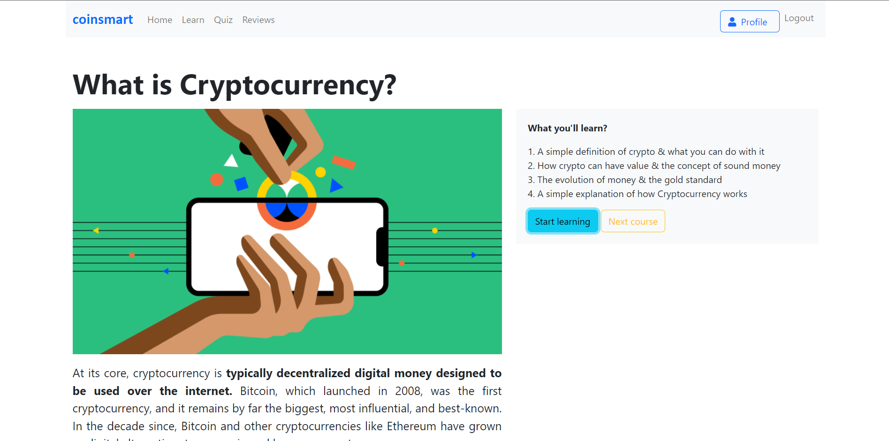
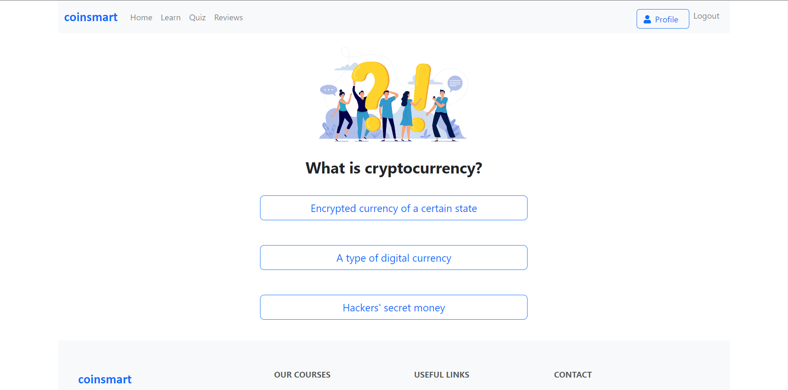
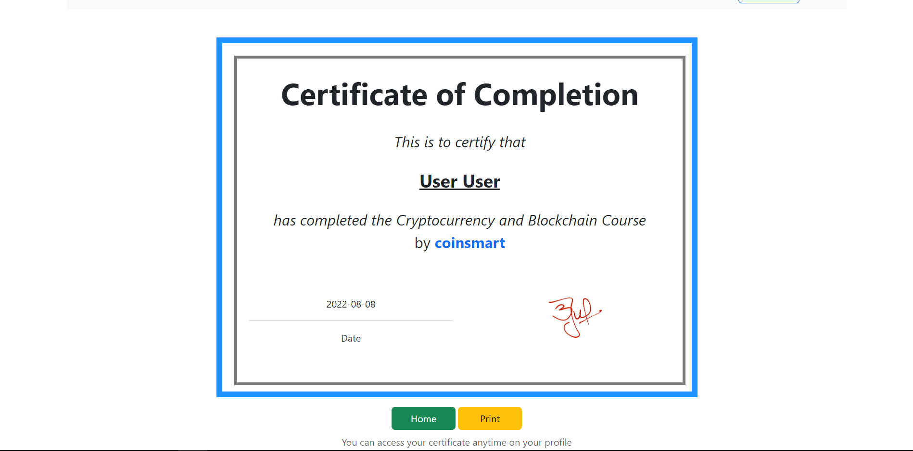
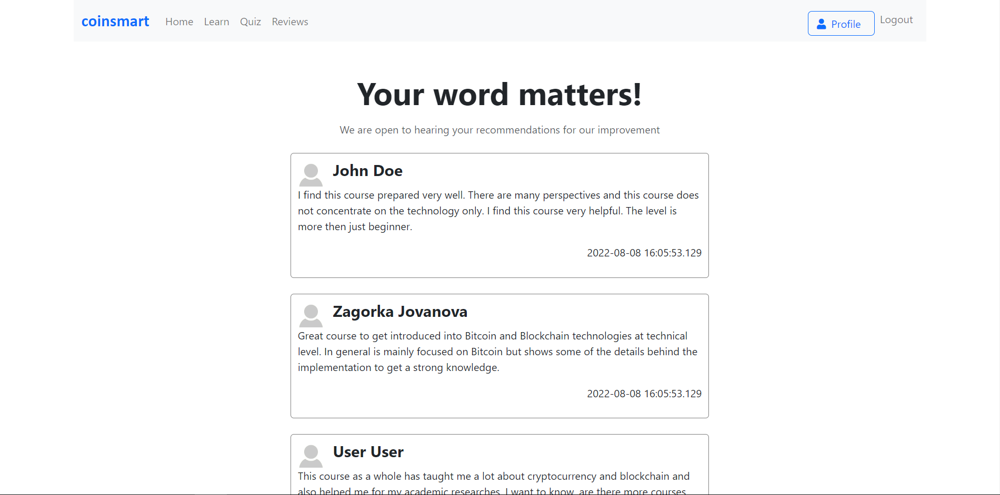

# coinsmart
<i>Cryptocurrency and Blockchain learning system</i> 

<b>“CoinSmart”</b> претставува систем за учење кој корисниците можат да го искористат за да се запознаат и да научат нешто повеќе на тема – <b>Cryptocurrency and Blockchain</b>  
Во имплементацијата на системот се искористени програмскиот јазик <b>Java, Spring Boot</b> и <b>H2 In-memory</b> база на податоци за back-end делот, а за front-end делот се искористени <b>HTML, CSS</b> и <b>Bootstrap.</b>

### Home page

### User profile

### Learn/Courses page

### Course page

### Quiz page

### Certificate

### Reviews page

